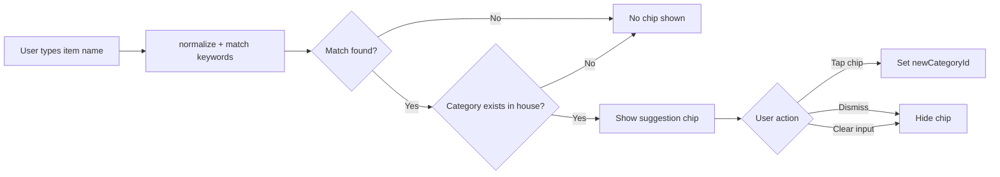

# Smart Tags (Shopping List) Design Document

## Overview

Smart Tags adds intelligent category suggestion to the shopping list input. When a user types an item name, the system matches it against a Spanish keyword dictionary and suggests the best matching category from the house's existing categories via a dismissible chip. This is a frontend-only feature with no backend changes.

## Design Summary (Meta)

```yaml
design_type: "new_feature"
risk_level: "low"
complexity_level: "low"
complexity_rationale: "N/A - low complexity"
main_constraints:
  - "Frontend-only: no backend or DB changes"
  - "Only suggest existing house categories, never auto-create"
  - "Mobile-first: 360px+, tap targets >= 44px"
  - "Design system colors only: surface, clay, moss, bark"
biggest_risks:
  - "Dictionary coverage gaps for regional Spanish vocabulary"
  - "Suggestion chip layout breaking on narrow screens"
unknowns:
  - "Optimal dictionary size for initial release (200-300 entries)"
```

## Background and Context

### Prerequisite ADRs

- None. No architecture, contract, data flow, or external dependency changes. This is a self-contained frontend utility with a new UI element in an existing page.

### Agreement Checklist

#### Scope
- [x] NEW `frontend/src/lib/smartTags.js` -- keyword dictionary + matching functions
- [x] MODIFY `frontend/src/pages/ShoppingList.jsx` -- suggestion chip UI + wiring

#### Non-Scope (Explicitly not changing)
- [x] Backend / API -- zero changes
- [x] Database schema -- zero changes
- [x] Shopping categories CRUD -- untouched
- [x] Existing category dropdown behavior -- preserved as-is
- [x] Auto-creation of categories -- explicitly excluded
- [x] Auto-assignment of categories -- explicitly excluded (user must tap to accept)

#### Constraints
- [x] Parallel operation: N/A (no migration)
- [x] Backward compatibility: Required -- existing add-item flow must work identically when no suggestion matches
- [x] Performance measurement: Not required -- dictionary lookup is O(n) on ~300 entries, negligible

#### Applicable Standards
- [x] JavaScript ES Modules, no semicolons, single quotes `[explicit]` - Source: `docs/ESTANDARES_CODIGO.md`
- [x] Functional components with hooks `[explicit]` - Source: `docs/ESTANDARES_CODIGO.md`
- [x] Tailwind CSS with design system colors `[explicit]` - Source: `docs/ESTANDARES_CODIGO.md`
- [x] Lib files in camelCase.js `[explicit]` - Source: `docs/ESTANDARES_CODIGO.md`
- [x] Mobile-first 360px+, tap targets >= 44px `[explicit]` - Source: `docs/TECHNICAL.md`
- [x] No over-engineering `[explicit]` - Source: `CLAUDE.md`
- [x] Code in English, UI in Spanish `[explicit]` - Source: `CLAUDE.md`
- [x] Helper/utility modules export pure functions `[implicit]` - Evidence: `frontend/src/lib/tasks.js` pattern -- Confirmed: Yes

### Problem to Solve

Users frequently add items to the shopping list without selecting a category, making the list ungrouped and harder to navigate in-store. Manually selecting from the category dropdown adds friction, especially on mobile.

### Current Challenges

- Category selection is optional and most users skip it
- No intelligence to assist the user -- the dropdown is purely manual
- Items without categories end up in a generic "Sin categoria" bucket

### Requirements

#### Functional Requirements

1. Match typed item name against a keyword dictionary of ~200-300 Spanish terms
2. Show a suggestion chip when a match is found AND the matched category exists in the house
3. User taps chip to accept (fills `newCategoryId`)
4. User can dismiss the chip without accepting
5. Chip disappears when input is cleared
6. Accent-insensitive matching (e.g., "jabon" matches "jabon" and "jabon")

#### Non-Functional Requirements

- **Performance**: Matching must feel instant (< 16ms per keystroke on mid-range phone)
- **Maintainability**: Dictionary is a simple object literal, easy to extend
- **Accessibility**: Chip must be focusable and dismissible via keyboard

## Acceptance Criteria (AC) - EARS Format

### Category Suggestion Display

- [ ] **When** user types an item name that contains a keyword mapped to a category that exists in the house, the system shall display a suggestion chip showing the category emoji and name
- [ ] **When** user types an item name with no keyword match, the system shall not display any suggestion chip
- [ ] **When** user types an item name matching a keyword whose mapped category does NOT exist in the house, the system shall not display any suggestion chip
- [ ] **When** user clears the input field, the system shall hide the suggestion chip

### Suggestion Acceptance

- [ ] **When** user taps the suggestion chip, the system shall set the category dropdown to the suggested category
- [ ] **When** user taps the suggestion chip, the system shall hide the suggestion chip
- [ ] **When** user taps the dismiss (X) button on the chip, the system shall hide the chip without changing the category

### Accent Normalization

- [ ] The matching shall treat accented and unaccented characters as equivalent (e.g., "jabon" matches dictionary entry "jabon", "limon" matches "limon")

### Existing Flow Preservation

- [ ] **While** no suggestion is shown, the add-item form shall behave identically to the current implementation
- [ ] **When** user manually selects a category from the dropdown, the system shall not override it with a suggestion
- [ ] **When** user submits the form, the system shall clear the suggestion chip along with the other fields

## Existing Codebase Analysis

### Implementation Path Mapping

| Type | Path | Description |
|------|------|-------------|
| Existing | `frontend/src/pages/ShoppingList.jsx` | Shopping list page with add-item form, category dropdown, item display |
| Existing | `frontend/src/lib/api.js` | API client with `fetchShoppingCategories()`, `createShoppingItem()` |
| Existing | `frontend/src/lib/tasks.js` | Example of lib utility pattern (pure functions + constants) |
| New | `frontend/src/lib/smartTags.js` | Keyword dictionary + matching logic |

### Integration Points

- **Integration Target**: `ShoppingList.jsx` add-item form
- **Invocation Method**: Call `suggestCategory(inputText, categories)` on `newName` state change; render chip conditionally

### Similar Functionality Search

- Searched for: "suggest", "match", "keyword", "normalize", "category" in `frontend/src/lib/`
- Result: **None found**. No existing suggestion, matching, or text normalization utilities exist.
- Decision: **New implementation** in `frontend/src/lib/smartTags.js`

### Code Inspection Evidence

| File/Function | Relevance |
|---------------|-----------|
| `ShoppingList.jsx:handleAdd()` (line 43) | Integration point -- must clear suggestion on submit |
| `ShoppingList.jsx:newName` state (line 13) | Integration point -- suggestion triggers on this value changing |
| `ShoppingList.jsx:newCategoryId` state (line 15) | Integration point -- chip acceptance sets this |
| `ShoppingList.jsx:categories` state (line 10) | Data source -- house categories to match against |
| `ShoppingList.jsx` input field (lines 167-179) | UI integration -- chip renders near this input |
| `ShoppingList.jsx` category dropdown (lines 208-226) | Must not be overridden when user manually selects |
| `lib/tasks.js` | Pattern reference -- lib file structure, pure function exports |

## Design

### Change Impact Map

```yaml
Change Target: ShoppingList add-item form
Direct Impact:
  - frontend/src/pages/ShoppingList.jsx (new state, new UI element, new import)
  - frontend/src/lib/smartTags.js (new file)
Indirect Impact:
  - None
No Ripple Effect:
  - Backend API (zero changes)
  - Database schema (zero changes)
  - ShoppingAdmin.jsx (category CRUD unaffected)
  - Other pages (no shared state)
  - ShoppingItem component (display only, unaffected)
```

### Architecture Overview



### Data Flow

```
1. User types in input → onChange updates `newName` state
2. useEffect/useMemo reacts to `newName` change:
   a. normalize(newName) → lowercase, strip accents
   b. Scan KEYWORD_TO_CATEGORY entries: check if normalized input contains any keyword
   c. If match found → get category name string from dictionary
   d. Find matching category in `categories` array by normalized name comparison
   e. If found → set `suggestedCategory` state to { id, name, emoji }
   f. If not found → set `suggestedCategory` to null
3. Render: if `suggestedCategory` is not null AND `newCategoryId` is empty → show chip
4. Chip tap → setNewCategoryId(suggestedCategory.id), setSuggestedCategory(null)
5. Chip dismiss → setSuggestedCategory(null), set dismissedForInput flag
6. Form submit → clears all states including suggestion
```

### Integration Points List

| Integration Point | Location | Old Implementation | New Implementation | Switching Method |
|-------------------|----------|-------------------|-------------------|------------------|
| Input change handler | `ShoppingList.jsx` line 170 | `setNewName(e.target.value)` | Same + trigger suggestion matching | Additional logic in effect |
| Category state | `ShoppingList.jsx` line 15 | Manual dropdown only | Dropdown + chip acceptance | Additive -- chip sets same state |
| Form submit | `ShoppingList.jsx` line 43 | Clears name, note, category | Also clears suggestion state | Additive |
| Form UI | `ShoppingList.jsx` lines 164-244 | Input + dropdown + note | Same + chip element below input | Additive DOM element |

### Main Components

#### Component 1: `smartTags.js` module

- **Responsibility**: Normalize text, match keywords against dictionary, resolve to house category
- **Interface**:
  ```js
  // Normalize a string: lowercase, strip accents
  export function normalizeText(text)

  // Find best category suggestion for input text
  // Returns { id, name, emoji } or null
  export function suggestCategory(inputText, categories)
  ```
- **Dependencies**: None (pure functions, no imports)

#### Component 2: Suggestion chip UI (inline in ShoppingList.jsx)

- **Responsibility**: Display suggestion, handle accept/dismiss interactions
- **Interface**: React JSX rendered conditionally based on `suggestedCategory` state
- **Dependencies**: `suggestCategory()` from smartTags.js, existing `categories` and `newCategoryId` state

### Data Representation Decision

| Criterion | Assessment | Reason |
|-----------|-----------|--------|
| Semantic Fit | N/A | No existing structure to reuse -- dictionary is new concept |
| Responsibility Fit | N/A | Keyword-to-category mapping has no existing equivalent |
| Lifecycle Fit | N/A | Static dictionary, no DB lifecycle |
| Boundary/Interop Cost | Low | Dictionary is internal to frontend, never crosses API boundary |

**Decision**: New structure -- `KEYWORD_TO_CATEGORY` is a plain object literal mapping normalized Spanish keywords to category name strings. This is the simplest possible representation.

### Contract Definitions

```js
// smartTags.js exports

/**
 * @param {string} text - Raw input text
 * @returns {string} - Lowercased, accent-stripped text
 */
export function normalizeText(text)

/**
 * @param {string} inputText - User-typed item name
 * @param {Array<{id: string, name: string, emoji: string}>} categories - House categories
 * @returns {{id: string, name: string, emoji: string} | null} - Suggested category or null
 */
export function suggestCategory(inputText, categories)
```

### Data Contract

#### smartTags.suggestCategory()

```yaml
Input:
  Type: (inputText: string, categories: Array<{id, name, emoji}>)
  Preconditions: inputText is a non-empty string; categories is the house's category array
  Validation: Returns null for empty/whitespace input

Output:
  Type: { id: string, name: string, emoji: string } | null
  Guarantees: Returned category always exists in the provided categories array
  On Error: Returns null (no exceptions thrown)

Invariants:
  - Never modifies input arguments
  - Deterministic: same inputs always produce same output
  - No side effects
```

### Integration Boundary Contracts

```yaml
Boundary Name: ShoppingList ↔ smartTags
  Input: newName string + categories array from React state
  Output: Category object or null (synchronous)
  On Error: Returns null -- chip simply not shown
```

### State Transitions

```yaml
State Definition:
  - Initial: suggestedCategory = null, dismissed = false
  - Suggesting: suggestedCategory = {id, name, emoji}
  - Accepted: suggestedCategory = null, newCategoryId = id
  - Dismissed: suggestedCategory = null, dismissed = true (for current input)

State Transitions:
  Initial → Suggesting: User types text that matches a keyword + house category
  Suggesting → Accepted: User taps the chip
  Suggesting → Dismissed: User taps X button
  Suggesting → Initial: User clears input or input no longer matches
  Dismissed → Suggesting: User changes input text (new match for different input)
  Any → Initial: Form submitted
```

### Error Handling

- `suggestCategory()` never throws -- returns `null` on any edge case (empty input, no categories, no match)
- If `categories` array is empty or not yet loaded, function returns `null`
- No error UI needed -- worst case is simply no suggestion shown

### Logging and Monitoring

- None required. This is a client-side UI convenience feature with no business-critical path.

## Implementation Plan

### Implementation Approach

**Selected Approach**: Vertical Slice
**Selection Reason**: This is a self-contained feature touching exactly 2 files (1 new, 1 modified) with zero external dependencies. Complete the dictionary + matching logic first, then wire it into the UI. The feature is immediately usable after a single implementation pass.

### Technical Dependencies and Implementation Order

#### 1. `frontend/src/lib/smartTags.js` (new file)
- **Technical Reason**: Pure utility module with no dependencies -- must exist before UI can import it
- **Contents**: `normalizeText()`, `suggestCategory()`, `KEYWORD_TO_CATEGORY` dictionary
- **Dependent Elements**: ShoppingList.jsx imports from this

#### 2. `frontend/src/pages/ShoppingList.jsx` (modification)
- **Technical Reason**: Depends on smartTags.js being available
- **Changes**:
  - Import `suggestCategory` from `../lib/smartTags`
  - Add `suggestedCategory` state (object or null)
  - Add `dismissedSuggestion` ref/state to track dismissal per input value
  - Add `useMemo` or `useEffect` to compute suggestion when `newName` changes
  - Render suggestion chip between input row and category/note row
  - Wire chip tap → `setNewCategoryId(suggestedCategory.id)`
  - Wire chip dismiss → clear suggestion, set dismissed flag
  - Clear suggestion state in `handleAdd`

### Integration Points

**Integration Point 1: Suggestion Computation**
- Components: `smartTags.suggestCategory()` → `ShoppingList` state
- Verification: Type a known keyword (e.g., "jabon"), verify chip appears with correct category

**Integration Point 2: Chip → Category State**
- Components: Chip tap → `setNewCategoryId`
- Verification: Tap chip, verify dropdown updates, submit item, verify item created with correct category

### Migration Strategy

No migration needed. This is purely additive -- no existing behavior is modified.

## Interface Change Matrix

| Existing Operation | New Operation | Conversion Required | Adapter Required | Compatibility Method |
|-------------------|---------------|-------------------|------------------|---------------------|
| `setNewName(value)` | `setNewName(value)` + suggestion recompute | None | Not Required | Suggestion computed reactively via useMemo |
| `setNewCategoryId(value)` via dropdown | Same + chip acceptance | None | Not Required | Chip uses same setter |
| `handleAdd()` clears form | Same + clears suggestion | None | Not Required | Additional clear statement |

## Test Strategy

### Basic Test Design Policy

Test the pure `smartTags.js` module independently. UI integration verified via manual testing (no E2E framework currently in project).

### Unit Tests

Target: `smartTags.js` -- pure functions, easily testable

| Test Case | AC Covered |
|-----------|------------|
| `normalizeText` strips accents correctly | Accent Normalization |
| `normalizeText` lowercases input | Accent Normalization |
| `suggestCategory` returns match when keyword found in input and category exists | Suggestion Display AC-1 |
| `suggestCategory` returns null when no keyword match | Suggestion Display AC-2 |
| `suggestCategory` returns null when matched category not in house | Suggestion Display AC-3 |
| `suggestCategory` returns null for empty input | Suggestion Display AC-4 |
| `suggestCategory` handles accented input matching unaccented dictionary | Accent Normalization |
| `suggestCategory` returns first match when input contains multiple keywords | Edge case |

### Integration Tests

Manual verification checklist (no automated E2E framework in project):
1. Type "detergente" → chip shows house's "Limpieza" category (if exists)
2. Tap chip → dropdown updates to Limpieza
3. Submit → item created with Limpieza category, chip clears
4. Type "detergente" → dismiss chip → chip hidden, dropdown stays on "Sin categoria"
5. Type "xyz random" → no chip shown
6. Clear input → chip hidden
7. Manually select category, then type matching keyword → manual selection not overridden

### Performance Tests

Not required. Dictionary scan of ~300 entries with string `includes()` is trivially fast.

## Security Considerations

- No security impact. Frontend-only, no user data transmitted, no new API calls.
- Dictionary is a static code asset, not user-generated content.

## Future Extensibility

- **Learning from user behavior**: Track which suggestions are accepted/dismissed to improve ranking (Fase 2+)
- **Backend dictionary**: Move dictionary to DB per-organization for customization (Fase 3+)
- **Multi-keyword match ranking**: When multiple keywords match, rank by specificity or frequency
- **Product history matching**: Suggest categories based on previously categorized items with same name

## Alternative Solutions

### Alternative 1: Backend matching with ML

- **Overview**: Use server-side text classification or embeddings to suggest categories
- **Advantages**: More accurate, learns from data, handles synonyms better
- **Disadvantages**: Requires backend changes, API latency, complexity, external dependencies
- **Reason for Rejection**: Over-engineering for current stage. Heuristic dictionary covers 80%+ of common household items in Spanish.

### Alternative 2: Auto-assign category (no user confirmation)

- **Overview**: Automatically set category without showing suggestion chip
- **Advantages**: Less friction -- zero taps needed
- **Disadvantages**: Users lose control, wrong matches frustrate, harder to override
- **Reason for Rejection**: Decision already made to use suggestion pattern. User confirmation respects user agency.

### Alternative 3: Fuzzy matching library (e.g., fuse.js)

- **Overview**: Use a fuzzy search library instead of keyword dictionary
- **Advantages**: Handles typos, partial matches, more flexible
- **Disadvantages**: Additional dependency (~5KB), overkill for keyword matching, harder to control false positives
- **Reason for Rejection**: Simple `includes()` on normalized strings is sufficient. Adding a dependency violates the no-over-engineering principle.

## Risks and Mitigation

| Risk | Impact | Probability | Mitigation |
|------|--------|-------------|------------|
| Dictionary misses common items | Low | Medium | Start with 200-300 high-frequency household items; expand based on user feedback |
| Chip layout breaks on narrow screens | Medium | Low | Use flex-wrap, test on 360px width |
| Suggestion flickers on fast typing | Low | Low | Use `useMemo` (synchronous) instead of debounced effect |
| Wrong category suggested | Low | Medium | Suggestion-only pattern -- user always has to confirm |

## References

- MDN: [`String.prototype.normalize()`](https://developer.mozilla.org/en-US/docs/Web/JavaScript/Reference/Global_Objects/String/normalize) -- NFD normalization for accent stripping
- Casa Limpia design system colors: `docs/ESTANDARES_CODIGO.md`
- Casa Limpia technical reference: `docs/TECHNICAL.md`

## Update History

| Date | Version | Changes | Author |
|------|---------|---------|--------|
| 2026-04-08 | 1.0 | Initial version | Claude (technical-designer) |
