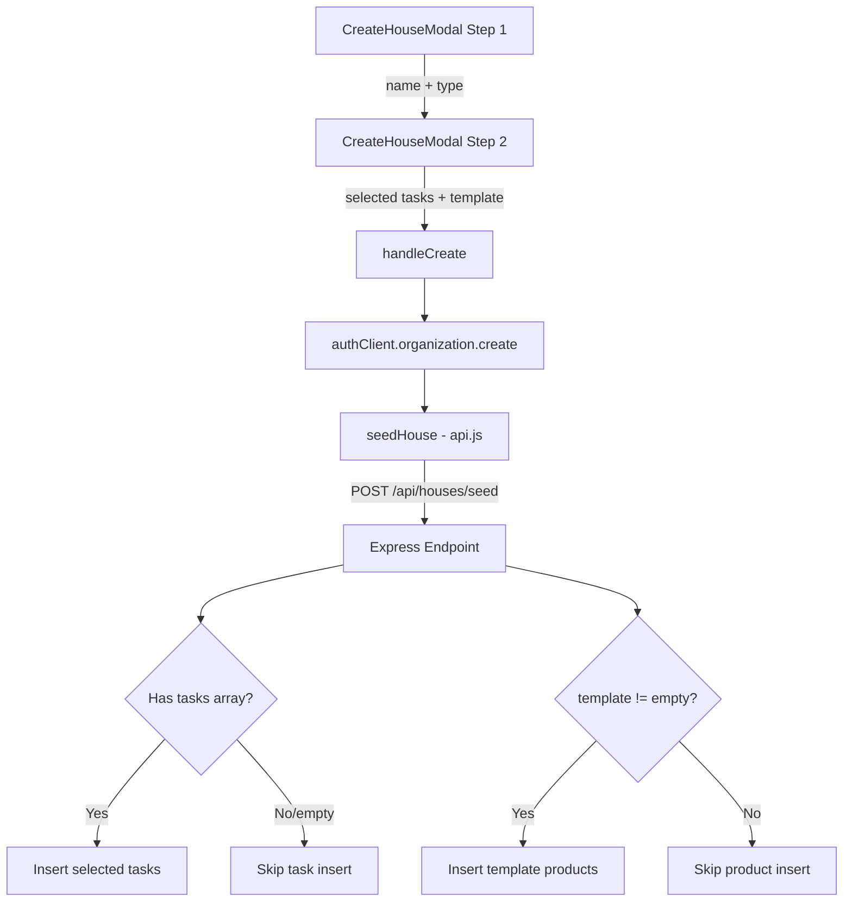

# Task Recommender during Onboarding - Design Document

## Overview

Improve the house creation onboarding flow by replacing the current single-step template selector with a two-step wizard: (1) house name + home type selection (5 types including new Airbnb and Oficina), and (2) a task checklist where users can select/deselect individual tasks before seeding. The backend seed endpoint is updated to accept an explicit list of selected tasks instead of a template name.

## Design Summary (Meta)

```yaml
design_type: "extension"
risk_level: "low"
complexity_level: "low"
complexity_rationale: "N/A - low complexity"
main_constraints:
  - "Multi-tenant security: all queries filter by organization_id"
  - "Mobile-first: 360px+, tap targets >= 44px"
  - "Monolith backend: server/index.js, keep additions minimal"
  - "Design system: surface, clay, moss, bark colors only"
biggest_risks:
  - "Regression on existing house creation flow"
  - "Large task catalog making the modal unwieldy on mobile"
unknowns:
  - "Exact task lists for airbnb and oficina templates (defined below as initial proposal)"
```

## Background and Context

### Prerequisite ADRs

No existing ADRs in the project. No common ADR needed for this change (no new patterns introduced).

### Agreement Checklist

#### Scope
- [x] Modify `CreateHouseModal` in `HouseSelect.jsx` to multi-step wizard
- [x] Add 2 new template types: `airbnb` and `oficina`
- [x] Add task preview/selection UI (Step 2 of wizard)
- [x] Modify `POST /api/houses/seed` to accept explicit task list
- [x] Update `seedHouse()` in `frontend/src/lib/api.js`

#### Non-Scope (Explicitly not changing)
- [x] Product seeding stays template-based (no product selection UI)
- [x] House selection grid and invitation system remain unchanged
- [x] No changes to tasks table schema
- [x] No changes to other pages (Home, Admin, Stats, etc.)
- [x] No AI/ML recommendation - purely heuristic catalog

#### Constraints
- [x] Parallel operation: Not applicable (new flow replaces old)
- [x] Backward compatibility: Not required (seed endpoint only called during onboarding, not by external clients)
- [x] Performance measurement: Not required (simple insert operation)

#### Applicable Standards
- [x] Parameterized SQL queries `[explicit]` - Source: `docs/ESTANDARES_CODIGO.md`
- [x] Functional components with hooks `[explicit]` - Source: `docs/ESTANDARES_CODIGO.md`
- [x] Tailwind CSS with design system colors `[explicit]` - Source: `docs/ESTANDARES_CODIGO.md`
- [x] Mobile-first 360px+ `[explicit]` - Source: `docs/TECHNICAL.md`
- [x] Code in English, UI in Spanish `[explicit]` - Source: `CLAUDE.md`
- [x] No semicolons, single quotes `[explicit]` - Source: `docs/ESTANDARES_CODIGO.md`
- [x] Template options defined as constants at module level `[implicit]` - Evidence: `HouseSelect.jsx:235-254` - Confirmed: Yes

### Problem to Solve

The current onboarding offers only 3 templates (small, family, empty) with no visibility into what tasks will be created. Users cannot customize which tasks are seeded, leading to either over-seeding (unwanted tasks) or under-seeding (choosing "empty" and having to create everything manually).

### Current Challenges

1. Users don't know what tasks each template includes before creating
2. Only 2 home types with pre-loaded tasks (small apartment, family house)
3. No way to deselect individual tasks from a template
4. The seed endpoint only accepts a template name, not a task list

### Requirements

#### Functional Requirements

- FR1: Offer 5 home type options: Apartamento, Casa familiar, Airbnb, Oficina, Personalizado
- FR2: Show a preview of all suggested tasks for the selected type with checkboxes
- FR3: Allow select/deselect of individual tasks before house creation
- FR4: Provide "Select all" / "Deselect all" toggle
- FR5: Seed only the selected tasks into the new house
- FR6: Products remain template-based (seeded automatically based on home type)

#### Non-Functional Requirements

- **Performance**: Seed operation completes in < 2 seconds (same as current)
- **Scalability**: N/A (single insert per house creation)
- **Reliability**: If seed fails, house is still created (current behavior preserved)
- **Maintainability**: Task catalog defined as a single constant, easy to update

## Acceptance Criteria (AC) - EARS Format

### FR1: Home Type Selection

- [x] **AC-1.1**: The system shall display 5 home type options: Apartamento, Casa familiar, Airbnb, Oficina, Personalizado
- [x] **AC-1.2**: **When** user selects a home type, the system shall highlight it and enable the "Next" button
- [x] **AC-1.3**: **When** user selects "Personalizado", the system shall proceed to Step 2 with no tasks pre-selected

### FR2: Task Preview

- [x] **AC-2.1**: **When** user proceeds to Step 2, the system shall display all tasks for the selected home type with checkboxes
- [x] **AC-2.2**: Each task entry shall show: checkbox, task name, description, and frequency badge
- [x] **AC-2.3**: All tasks shall be pre-selected (checked) by default, except for "Personalizado"

### FR3: Task Selection

- [x] **AC-3.1**: **When** user taps a task checkbox, the system shall toggle its selection state
- [x] **AC-3.2**: **When** no tasks are selected, the "Crear casa" button shall remain enabled (creates empty house)
- [x] **AC-3.3**: The system shall display a count of selected tasks (e.g., "12 de 16 tareas seleccionadas")

### FR4: Bulk Actions

- [x] **AC-4.1**: **When** user taps "Seleccionar todo", the system shall check all tasks
- [x] **AC-4.2**: **When** user taps "Deseleccionar todo", the system shall uncheck all tasks

### FR5: Seed with Selected Tasks

- [x] **AC-5.1**: **When** user submits the form, the system shall send only selected task objects to the seed endpoint
- [x] **AC-5.2**: **When** seed endpoint receives a tasks array, the system shall insert only those tasks
- [x] **AC-5.3**: **When** seed endpoint receives an empty tasks array, the system shall skip task insertion and only seed products
- [x] **AC-5.4**: The seed endpoint shall validate each task object has required fields (name, frequency_type, frequency_value)
- [x] **AC-5.5**: **If** a task object is missing required fields, **then** the system shall return a 400 error

### FR6: Product Seeding

- [x] **AC-6.1**: Products shall be seeded based on the template type, not user selection
- [x] **AC-6.2**: **When** template is "empty" (Personalizado), no products shall be seeded

## Existing Codebase Analysis

### Implementation Path Mapping

| Type | Path | Description |
|------|------|-------------|
| Existing | `frontend/src/pages/HouseSelect.jsx` | CreateHouseModal component + TEMPLATES constant |
| Existing | `frontend/src/lib/api.js:225-227` | `seedHouse()` function |
| Existing | `server/index.js:245-338` | `POST /api/houses/seed` endpoint |
| Existing | `db/init.sql:1-12` | tasks table schema |
| New | (none) | No new files needed |

### Integration Points

- **Integration Target**: `handleCreate()` in `HouseSelect.jsx` calls `seedHouse()` from `api.js`
- **Invocation Method**: Direct function call, sequential after org creation

### Similar Functionality Search

Searched for: task templates, seed, onboarding, catalog, checklist patterns.
- `server/index.js` seed endpoint: **Direct modification target** (not duplication)
- No other task catalog or template systems exist in the codebase
- **Decision**: Extend existing implementation (modify seed endpoint + modal)

### Code Inspection Evidence

| File/Function | Relevance |
|---------------|-----------|
| `HouseSelect.jsx:TEMPLATES` (line 235-254) | Pattern reference: template constant definition |
| `HouseSelect.jsx:CreateHouseModal` (line 256-359) | Integration point: modal to be extended |
| `HouseSelect.jsx:handleCreate()` (line 47-70) | Integration point: orchestrates org creation + seed |
| `server/index.js:245-338` (POST /api/houses/seed) | Integration point: seed endpoint to modify |
| `frontend/src/lib/api.js:seedHouse()` (line 225-227) | Integration point: API client function |
| `db/init.sql:tasks` (line 1-12) | Pattern reference: task column schema |

## Design

### Change Impact Map

```yaml
Change Target: House creation onboarding flow
Direct Impact:
  - frontend/src/pages/HouseSelect.jsx (CreateHouseModal rewrite, TEMPLATES update)
  - frontend/src/lib/api.js (seedHouse signature change)
  - server/index.js (POST /api/houses/seed request body change)
Indirect Impact:
  - None (seed endpoint is only called from HouseSelect during onboarding)
No Ripple Effect:
  - Home.jsx, Admin.jsx, Stats.jsx (no dependency on seed endpoint)
  - tasks table schema (no changes)
  - Other API endpoints (no dependency)
  - Product seeding logic (products still template-based)
```

### Architecture Overview



### Data Flow

```
User selects home type (step 1)
  -> TASK_CATALOG[type] provides suggested tasks (frontend constant)
  -> User toggles checkboxes (step 2)
  -> Submit: { template: 'airbnb', tasks: [{name, description, frequency_type, frequency_value}, ...] }
  -> POST /api/houses/seed
  -> Backend inserts only the tasks from the array
  -> Backend inserts products based on template string (unchanged logic)
```

### Integration Points List

| Integration Point | Location | Old Implementation | New Implementation | Switching Method |
|-------------------|----------|-------------------|-------------------|------------------|
| Modal flow | `CreateHouseModal` | Single-step: name + template radio | Two-step wizard: Step 1 (name + type) -> Step 2 (task checklist) | Direct replacement |
| handleCreate call | `HouseSelect.handleCreate` | `handleCreate(name, template)` | `handleCreate(name, template, selectedTasks)` | Add parameter |
| seedHouse API | `api.js:seedHouse` | `seedHouse(template)` sends `{template}` | `seedHouse(template, tasks)` sends `{template, tasks}` | Add parameter |
| Seed endpoint | `server/index.js` | Reads `req.body.template`, uses hardcoded arrays | Reads `req.body.tasks` array if present, falls back to template-based | Conditional logic |

### Interface Change Matrix

| Existing Operation | New Operation | Conversion Required | Adapter Required | Compatibility Method |
|-------------------|---------------|-------------------|------------------|---------------------|
| `seedHouse(template)` | `seedHouse(template, tasks)` | Yes | No | Optional second parameter with default |
| `handleCreate(name, template)` | `handleCreate(name, template, selectedTasks)` | Yes | No | Third parameter added |
| `POST /api/houses/seed {template}` | `POST /api/houses/seed {template, tasks?}` | No | No | `tasks` is optional, backward compatible |

### Main Components

#### Component 1: Task Catalog (Frontend Constant)

- **Responsibility**: Define the complete catalog of tasks per home type as a static constant
- **Interface**: `TASK_CATALOG` object keyed by template type, each value is an array of task objects
- **Dependencies**: None (pure data)

```javascript
const TASK_CATALOG = {
  small: [
    { name: 'Barrer la cocina', description: 'Incluir debajo de la nevera', frequencyType: 'daily', frequencyValue: 1 },
    // ... 8 tasks total (same as current smallTasks)
  ],
  family: [
    // ... 16 tasks total (smallTasks + familyExtra, same as current)
  ],
  airbnb: [
    { name: 'Cambiar sabanas', description: 'Todas las camas y fundas de almohada', frequencyType: 'daily', frequencyValue: 1 },
    { name: 'Limpiar banos', description: 'Desinfectar inodoro, lavabo, ducha, reponer toallas', frequencyType: 'daily', frequencyValue: 1 },
    { name: 'Aspirar y fregar suelos', description: 'Todas las habitaciones y zonas comunes', frequencyType: 'daily', frequencyValue: 1 },
    { name: 'Desinfectar superficies', description: 'Mesas, interruptores, manijas de puertas', frequencyType: 'daily', frequencyValue: 1 },
    { name: 'Limpiar cocina completa', description: 'Electrodomesticos, encimera, fregadero', frequencyType: 'daily', frequencyValue: 1 },
    { name: 'Revisar amenities', description: 'Jabon, champu, papel higienico, cafe, te', frequencyType: 'daily', frequencyValue: 1 },
    { name: 'Lavar toallas y ropa de cama', description: 'Ciclo completo con desinfectante', frequencyType: 'daily', frequencyValue: 1 },
    { name: 'Revisar inventario', description: 'Vajilla, utensilios, mantas, control remoto', frequencyType: 'weekly', frequencyValue: 7 },
    { name: 'Limpiar ventanas', description: 'Cristales interiores y marcos', frequencyType: 'biweekly', frequencyValue: 14 },
    { name: 'Limpiar terraza/balcon', description: 'Barrer, limpiar muebles exteriores', frequencyType: 'weekly', frequencyValue: 7 },
    { name: 'Revisar electrodomesticos', description: 'Funcionamiento de horno, microondas, nevera', frequencyType: 'monthly', frequencyValue: 30 },
    { name: 'Limpieza profunda', description: 'Debajo de muebles, cortinas, tapicerias', frequencyType: 'monthly', frequencyValue: 30 },
  ],
  oficina: [
    { name: 'Vaciar papeleras', description: 'Todas las estaciones de trabajo', frequencyType: 'daily', frequencyValue: 1 },
    { name: 'Limpiar escritorios', description: 'Superficies y monitores', frequencyType: 'daily', frequencyValue: 1 },
    { name: 'Desinfectar banos', description: 'Inodoros, lavabos, espejos, reponer jabon', frequencyType: 'daily', frequencyValue: 1 },
    { name: 'Barrer y fregar suelos', description: 'Todas las areas comunes', frequencyType: 'daily', frequencyValue: 1 },
    { name: 'Limpiar cocina/comedor', description: 'Microondas, nevera exterior, mesas', frequencyType: 'daily', frequencyValue: 1 },
    { name: 'Reponer suministros', description: 'Papel higienico, jabon, toallas de papel', frequencyType: 'weekly', frequencyValue: 7 },
    { name: 'Aspirar alfombras', description: 'Oficinas y sala de reuniones', frequencyType: 'weekly', frequencyValue: 7 },
    { name: 'Limpiar cristales', description: 'Puertas de vidrio y mamparas', frequencyType: 'biweekly', frequencyValue: 14 },
    { name: 'Desinfectar telefonos y teclados', description: 'Equipos compartidos', frequencyType: 'weekly', frequencyValue: 7 },
    { name: 'Limpieza profunda de nevera', description: 'Interior completo, desechar caducados', frequencyType: 'monthly', frequencyValue: 30 },
  ],
  empty: [],
}
```

#### Component 2: CreateHouseModal (Multi-step Wizard)

- **Responsibility**: Two-step house creation wizard with name/type selection and task checklist
- **Interface**: `onSave(name, template, selectedTasks)`, `onClose()`
- **Dependencies**: `TASK_CATALOG`, `TEMPLATES` constants

**State management**:
- `step` (1 or 2)
- `name` (string)
- `template` (string key)
- `selectedTasks` (Set of indices into `TASK_CATALOG[template]`)

**Step 1 UI**: House name input + 5 template cards (current UI extended with 2 new options)
**Step 2 UI**: Task checklist with checkboxes, select/deselect all, task count, back button

#### Component 3: Updated Seed Endpoint

- **Responsibility**: Insert user-selected tasks and template-based products into the house
- **Interface**: `POST /api/houses/seed` with body `{ template, tasks? }`
- **Dependencies**: PostgreSQL pool, requireAuth, requireHouse, requireRole middlewares

### Data Representation Decision

| Criterion | Assessment | Reason |
|-----------|-----------|--------|
| Semantic Fit | Yes | Tasks are inserted into existing `tasks` table |
| Responsibility Fit | Yes | Same bounded context (house onboarding) |
| Lifecycle Fit | Yes | Created once during house setup |
| Boundary/Interop Cost | Low | Frontend sends task objects matching DB columns |

**Decision**: Reuse existing `tasks` table schema. No new data structures needed.

### Contract Definitions

#### Seed Request Body (Updated)

```javascript
// POST /api/houses/seed
{
  template: 'small' | 'family' | 'airbnb' | 'oficina' | 'empty',  // Required
  tasks: [                                                          // Optional
    {
      name: string,             // Required, non-empty
      description: string,      // Optional
      frequency_type: string,   // Required: 'daily'|'weekly'|'biweekly'|'monthly'
      frequency_value: number,  // Required: positive integer
    }
  ]
}
```

### Data Contract

#### Seed Endpoint

```yaml
Input:
  Type: { template: string, tasks?: Array<TaskSeedObject> }
  Preconditions:
    - User authenticated and member of house
    - User has 'owner' or 'admin' role
    - House has no existing tasks (duplicate prevention)
    - template is one of: small, family, airbnb, oficina, empty
  Validation:
    - If tasks array present, each element must have name (non-empty string), frequency_type (valid enum), frequency_value (positive integer)

Output:
  Type: { ok: true, template: string }
  Guarantees: Tasks and products inserted atomically (single transaction)
  On Error: 400 for validation errors, 500 for DB errors

Invariants:
  - All inserted tasks belong to the requesting house (organization_id)
  - Existing house data check prevents duplicate seeding
```

### Field Propagation Map

| Field | Boundary | Status | Detail |
|-------|----------|--------|--------|
| `name` | Frontend TASK_CATALOG -> API -> DB `tasks.name` | transformed | camelCase key in catalog, snake_case in DB |
| `description` | Frontend TASK_CATALOG -> API -> DB `tasks.description` | preserved | Same string |
| `frequencyType` | Frontend TASK_CATALOG -> API `frequency_type` -> DB `tasks.frequency_type` | transformed | camelCase in catalog constant, snake_case in API payload and DB |
| `frequencyValue` | Frontend TASK_CATALOG -> API `frequency_value` -> DB `tasks.frequency_value` | transformed | Same transformation as above |
| `template` | Frontend -> API -> used for product selection | preserved | String key, not stored in tasks |

**Note**: The frontend `TASK_CATALOG` uses camelCase keys for JS convention, but when sending to the API the keys are transformed to snake_case to match the DB schema. This transformation happens when building the request payload.

### Integration Boundary Contracts

```yaml
Boundary Name: Frontend Modal -> API Client (seedHouse)
  Input: template (string), tasks (array of task objects with snake_case keys)
  Output: Promise<{ ok: true, template: string }> (async)
  On Error: Silently caught in handleCreate (seed failure doesn't block house creation)

Boundary Name: API Client -> Express Seed Endpoint
  Input: POST body { template: string, tasks?: TaskSeedObject[] }
  Output: JSON { ok: true, template: string } (sync HTTP response)
  On Error: 400 (validation) or 500 (DB error) with { error: string }
```

### Error Handling

| Error | Handling |
|-------|----------|
| Invalid task object in array (missing name/frequency_type/frequency_value) | Return 400 with descriptive error |
| House already has tasks | Return 400 "Esta casa ya tiene datos" (existing behavior) |
| DB insertion failure | Return 500 with error message (existing behavior) |
| Seed endpoint failure from frontend | Silently caught, house still created (existing behavior) |

### Product Catalog for New Templates

Products for `airbnb`:
```javascript
const airbnbProducts = [
  ...baseProducts,       // 9 base products (same as small)
  ['Desinfectante',      'limpieza',   14],
  ['Ambientador',        'bano',       14],
  ['Bolsas de aspiradora', 'limpieza', 60],
]
```

Products for `oficina`:
```javascript
const oficinaProducts = [
  ['Jabon de manos',     'bano',       14],
  ['Papel higienico',    'bano',       14],
  ['Toallas de papel',   'bano',       14],
  ['Bolsas de basura',   'limpieza',   7],
  ['Desinfectante',      'limpieza',   14],
  ['Limpiacristales',    'limpieza',   30],
  ['Fregasuelos',        'limpieza',   14],
]
```

## Implementation Plan

### Implementation Approach

**Selected Approach**: Vertical Slice
**Selection Reason**: This is a self-contained feature with minimal external dependencies. All changes (frontend modal, API client, backend endpoint) serve a single user flow. Implementing end-to-end allows immediate verification.

### Technical Dependencies and Implementation Order

#### Required Implementation Order

1. **Task Catalog Constant (Frontend)**
   - Technical Reason: Pure data, no dependencies. Defines the source of truth for all templates.
   - Dependent Elements: CreateHouseModal Step 2 UI

2. **Backend Seed Endpoint Update (server/index.js)**
   - Technical Reason: Must accept new payload format before frontend sends it
   - Dependent Elements: Frontend API client

3. **API Client Update (api.js)**
   - Technical Reason: Bridge between modal and endpoint
   - Prerequisites: Endpoint accepts new format

4. **CreateHouseModal Rewrite (HouseSelect.jsx)**
   - Technical Reason: Depends on catalog data and updated API client
   - Prerequisites: Task catalog, API client updated

### Integration Points

**Integration Point 1: Modal -> API Client**
- Components: `CreateHouseModal` -> `seedHouse()`
- Verification: Create house with airbnb template, verify selected tasks are sent in request

**Integration Point 2: API Client -> Seed Endpoint**
- Components: `seedHouse()` -> `POST /api/houses/seed`
- Verification: Check DB for correct tasks inserted matching the selection

### Migration Strategy

The seed endpoint change is backward compatible: if `tasks` array is not provided, the endpoint falls back to the current template-based behavior. This means if the frontend update deploys slightly after the backend, the old frontend still works.

## Test Strategy

### Manual Test Plan

Since the project has no test infrastructure, verification is manual:

1. **Happy path**: Create house with each of the 5 types, verify correct tasks appear in Admin page
2. **Task deselection**: Select "Casa familiar", deselect 5 tasks, create house, verify only 11 tasks exist
3. **Empty selection**: Select "Apartamento", deselect all tasks, create house, verify no tasks but products exist
4. **Personalizado**: Select "Personalizado", verify no tasks pre-selected, create house, verify empty
5. **Mobile**: Test full flow on 360px viewport, verify scroll, tap targets, modal sizing
6. **Back button**: Go to Step 2, press back, verify Step 1 state preserved
7. **Validation**: Send malformed task to endpoint via curl, verify 400 response

### E2E Verification

| Step | Action | Expected Result |
|------|--------|----------------|
| 1 | Click "Nueva casa" | Modal opens at Step 1 |
| 2 | Enter name, select "Airbnb" | Airbnb card highlighted |
| 3 | Click "Siguiente" | Step 2 shows 12 tasks, all checked |
| 4 | Uncheck 3 tasks | Count shows "9 de 12 tareas seleccionadas" |
| 5 | Click "Crear casa" | House created, navigated to home |
| 6 | Open Admin page | 9 tasks visible (the 9 selected ones) |

## Security Considerations

- **Multi-tenant**: Seed endpoint already uses `req.house.id` (from `requireHouse` middleware) as `organization_id`. No change needed.
- **SQL injection**: All task data inserted via parameterized queries (`$1, $2...`).
- **Input validation**: Backend validates task objects have required fields and valid frequency_type values.
- **Role check**: Endpoint requires `owner` or `admin` role (existing `requireRole` middleware).

## Future Extensibility

- **Phase 2 - Rotacion automatica**: Task catalog can be extended with a `rotation_group` field
- **Phase 4 - Templates por tipo de propiedad**: `TASK_CATALOG` can be moved to a shared module or fetched from DB
- **Product selection UI**: Same checklist pattern can be applied to products in a future iteration

## Alternative Solutions

### Alternative 1: Server-side Task Catalog

- **Overview**: Move TASK_CATALOG to the backend, expose via GET endpoint, frontend fetches on modal open
- **Advantages**: Single source of truth, easier to update without frontend deploy
- **Disadvantages**: Extra API call, adds latency to modal open, more backend code
- **Reason for Rejection**: Over-engineering for current scale. Catalog is static and small. Frontend constant is simpler and follows existing patterns (TEMPLATES is already a frontend constant).

### Alternative 2: Database-stored Templates

- **Overview**: Store task templates in a DB table, admin can edit them
- **Advantages**: Editable without code changes, supports user-created templates
- **Disadvantages**: Requires new table, migration, admin UI for template management
- **Reason for Rejection**: Premature abstraction. No current requirement for editable templates. Can be added later if needed.

### Alternative 3: Keep Template-based Seed, Add Preview Only

- **Overview**: Show task preview but don't allow deselection. Send template name to backend as before.
- **Advantages**: No backend changes needed
- **Disadvantages**: Doesn't solve the customization problem. Users still get all-or-nothing.
- **Reason for Rejection**: Doesn't meet the core requirement of task selection.

## Risks and Mitigation

| Risk | Impact | Probability | Mitigation |
|------|--------|-------------|------------|
| Modal too tall on small screens with many tasks | Medium | Medium | Scrollable task list with sticky header/footer buttons |
| User confusion with two-step flow | Low | Low | Clear step indicators and back button |
| Large task array in POST body | Low | Low | Max ~20 tasks per template, negligible payload size |

## References

- Current implementation reviewed directly from codebase (no external libraries or new technology introduced)

## Update History

| Date | Version | Changes | Author |
|------|---------|---------|--------|
| 2026-04-08 | 1.0 | Initial version | Claude (technical-designer) |
